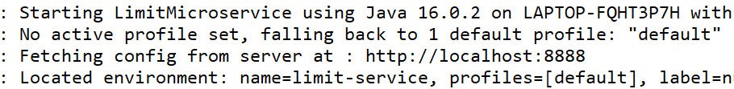
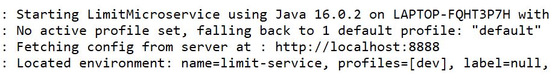

## SpringBoot Microservices

SMALL AUTONOMOUS SERVICES THAT WORK TOGETHER -  _  SAM NEWMAN_

**Microservices**

	.Rest
	.& Small Well Chosen Deployable Units
	.Cloud Enabled
	
**Challenges in Microservices**

Bounded context

	how to set right boundary for your microservices ie which microservice will do what
	
Configuration Management

	100s of microservices and tons of environment to manage how do we simplify that.

Dynamically Scale up and Scale down
	
	Dynamically scale up and scale down and dynamically distribute the load between the active instances

Visibility
	
	We should have great visibility of whats happening between each microservices

Fault tolerance

	How do I make sure that failure of one microservice will not affect other microservices
	
## Limit Microservice

This microservice is called limit microservices

Add following dependencies to your `pom.xml` 

```xml
<dependency>
			<groupId>org.springframework.boot</groupId>
			<artifactId>spring-boot-starter-web</artifactId>
		</dependency>
		<dependency>
			<groupId>org.springframework.boot</groupId>
			<artifactId>spring-boot-devtools</artifactId>
		</dependency>
		<dependency>
			<groupId>org.springframework.boot</groupId>
			<artifactId>spring-boot-starter-actuator</artifactId>
		</dependency>
		<dependency>
	    <groupId>org.springframework.cloud</groupId>
		    <artifactId>spring-cloud-starter-config</artifactId>
		    <version>3.1.1</version>
		</dependency>
```

`spring-cloud-starter-config` is required so that out limit microservice can contact with the Spring cloud server to fetch the applications configuration.

Add following to `application.perperties` 

```.properties
spring.config.import = optional:configserver:http://localhost:8888 
#optional because we don't have config server availabe with us right now .
```
By this the spring cloud client will know how to connect to the spring cloud config server.

---

Creating a simple Microservice
--

Now if you see the project you will find `LimitController.java` with `GetMapping("/limits")` that returns hardcoded minimum and maximum limits.

So basically we have created a simple microservice that gives us minimum and maximum limit value .

We can avoid hard-coding by creating configuration class in configuration package that will read the minimum and maximum values of limits from `applications.properties` file.

----

Connecting Limit Microservice application (running on port : 8080) to our Spring cloud config server application(runnig on port : 8888)
--

Create another spring boot project and call it config -server it will be responsible to fetch configuration data of all the other microservices from central `git repository` that we will create in few steps :)

Change the port of your config-server to 8888 ( standard practice ) in your `application.properties` file of config-server application.

`creating git repo that will store configuration accessible to config-server application (running on port : 8888)`
-
1.Choose any folder or create a new one at any location accessible to you.
2.Open this folder in vs code or any other ide and create a file inside of it called `limit-service.properties` and all following to it 
	

	limit-service.minimum = 1
	limit-service.maximum =888
	#And finally stage and commit the file to the local repo.
	
`Connecting spring cloud config server to this local git repo`
-
Add path of the `limit-service.properties` to `application.properties` file of the Spring cloud config server application

```.properties
spring.cloud.config.server.git.uri=file:///C:/prashant_softwares/springboot_projects/git-repo-microservice-configuration/git-local-configuration-repo/

```
And you will be able to access the repo file at `localhost:8888/limit-service/default`

`Finally Connecting our limit microservice application to Spring cloud config server application`
-
What configuration from cloud config server should our microservice (limit microservice running on 8080) make use of : It should make use of `limit-service.properties` (which is configured in Spring cloud config server )

Hence add following to `application.properties` of microservice application (which is running on port : 8080)

`spring.application.name = limit-service`

Now you can access `localhost:8888/limit-service/default` to get values stored in the `limit-service.properties` file accessible to Spring cloud config server.

Creating multiple copies of configuration files (for different environment like QA,DEV etc) in the central repository accessible to config-server
-
Creating file like 

`limit-service-dev.properties` 

`limit-service-qa.properties`

Now, you can access these properties at url : `localhost:8888/limit-service/dev` or `localhost:8888/limit-service/qa` 

In order to access these properties from the limit-service we need to configure the profile in the `application.properties` file of limit-microservice.

`spring.profiles.active = dev` 
or 
`spring.profiles.active = qa`

but the microservice will pickup the default path in order to change it to dev or qa you need to add the config in the `application.properties`



 add following to change the default path to dev or qa as : `spring.cloud.config.profile = dev`
 
 


